# Project Report — Used Car Price Prediction System (DSCI 441)

## Abstract

This project builds an end-to-end regression system to predict **used car listing prices (USD)** from Craigslist listing attributes. The modeling challenge is that used-car prices are **heavy‑tailed** (a small number of expensive vehicles dominate scale-sensitive errors), many columns have **missing values**, and several effects are **nonlinear** (e.g., the mileage–price relationship depends on vehicle age and category). I evaluate a progression of models: linear baselines (**OLS**, **Ridge**, **Lasso**), a feature-engineered linear model (**Ridge + TF‑IDF(description)**), and a nonlinear boosted-tree model (**HistGradientBoostingRegressor**) with ordinal-encoded categoricals.

On a fixed train/test split (80/20, seed=441), the best broad-domain model achieves **test R² = 0.8061** (boosted trees). Diagnostics show heteroskedasticity (absolute dollar error increases with price), which explains why a single global RMSE target is difficult to interpret without specifying an operating domain. I therefore report both broad-domain results and mid‑market filtered results to illustrate the trade-off between coverage and absolute-error magnitude.

## Key takeaways

- The target distribution is heavy‑tailed, so **log-target training** and nonlinear models are important.
- Linear baselines underfit; adding text helps; boosted trees provide the best broad-domain fit.
- Error grows with price (**heteroskedasticity**), so “RMSE in dollars” must be interpreted relative to the price range.
- The Streamlit demo provides an interactive “enter features → predict price” deliverable.

## 1. Problem statement and deliverables

**Problem**: estimate a used car’s listing price from tabular listing attributes.  
**Deliverables**: model comparison, diagnostics, feature-importance analysis, and a runnable demo.

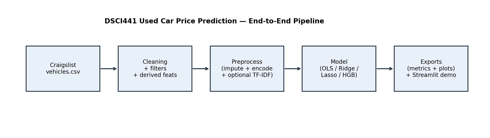

*Figure 1. End-to-end project pipeline.*

This diagram summarizes the full workflow: starting from raw listings, I apply cleaning and feature derivation, then fit a model in a preprocessing pipeline, and finally export plots/metrics and serve a small interactive demo. The key reason for the pipeline design is to keep preprocessing consistent across models and make experiments comparable. The final deliverable is not just a single number but a validated and explainable system.

## 2. Dataset and exploratory analysis

**Dataset**: “Craigslist Cars & Trucks” (Kaggle), containing **426,880** listings. The dataset includes numeric variables (`year`, `odometer`, latitude/longitude) and many categorical attributes (`manufacturer`, `condition`, `fuel`, `transmission`, `drive`, `type`, `state`, etc.), plus free‑text `description`.

### 2.1 Price distribution (heavy tail)

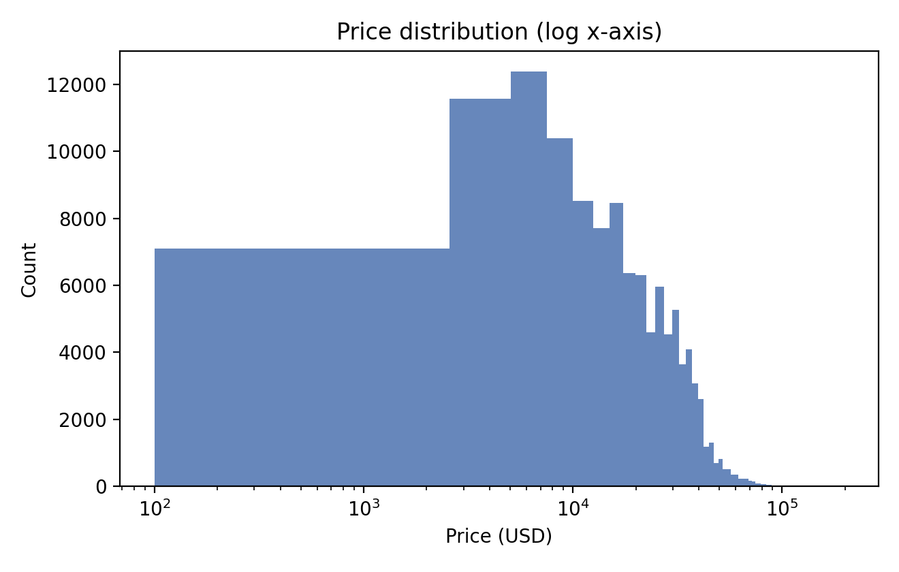

*Figure 2. Price histogram (log-scaled x-axis).*

The price distribution is extremely right-skewed: most listings cluster at lower prices while a small fraction occupy a very high-price tail. This matters because RMSE squares errors, so rare expensive listings can dominate the metric even if typical listings are predicted reasonably well. The heavy tail motivates training with a log-transformed target (to reduce tail dominance during fitting) and motivates reporting additional practical error summaries beyond RMSE.

### 2.2 Odometer distribution (long tail)

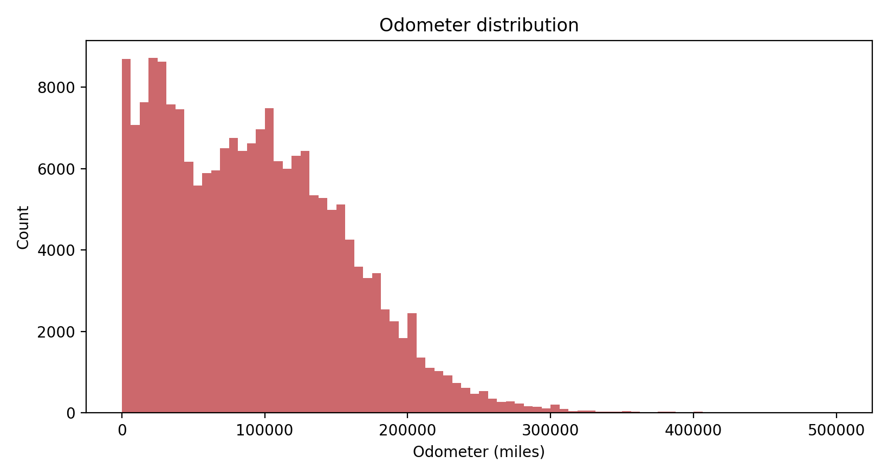

*Figure 3. Odometer histogram (after basic filtering).*

Mileage has a long-tailed distribution as well, with many vehicles concentrated in moderate ranges but a noticeable tail at very high odometer values. Extremely large mileage values often correspond to different vehicle segments (commercial fleets, older models) and can behave differently in price. This motivates basic plausibility filtering and suggests that nonlinear models may capture “diminishing returns” effects where mileage hurts price more strongly in some ranges than others.

### 2.3 Price vs year (strong age signal)

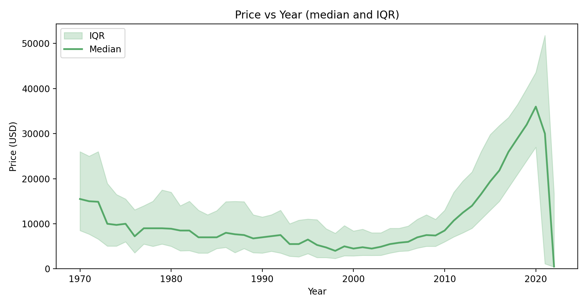

*Figure 4. Median price by model year with spread band.*

Model year is one of the strongest drivers of price: newer vehicles are substantially more expensive on average, and the spread increases for newer years due to a wider variety of trims and segments. This supports creating an explicit “vehicle age” feature (age is a more directly meaningful variable than year) and suggests interactions: the effect of mileage is not constant across years (100k miles means something different for a 2010 vs 2022 vehicle).

### 2.4 Price vs odometer (noisy, nonlinear relationship)

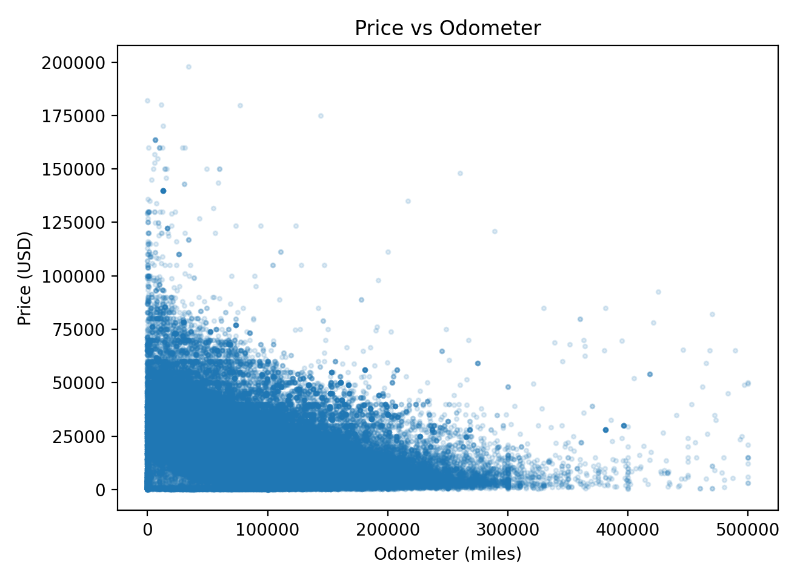

*Figure 5. Price vs odometer scatter.*

The overall trend is downward—higher mileage generally correlates with lower price—but the relationship is highly noisy and clearly nonlinear. The same odometer value can correspond to very different prices depending on year, manufacturer, and vehicle type. This plot is an early indicator that a purely linear model is likely to underfit and that interaction-capable models (boosted trees) should perform better.

### 2.5 Usage intensity: price vs miles/year

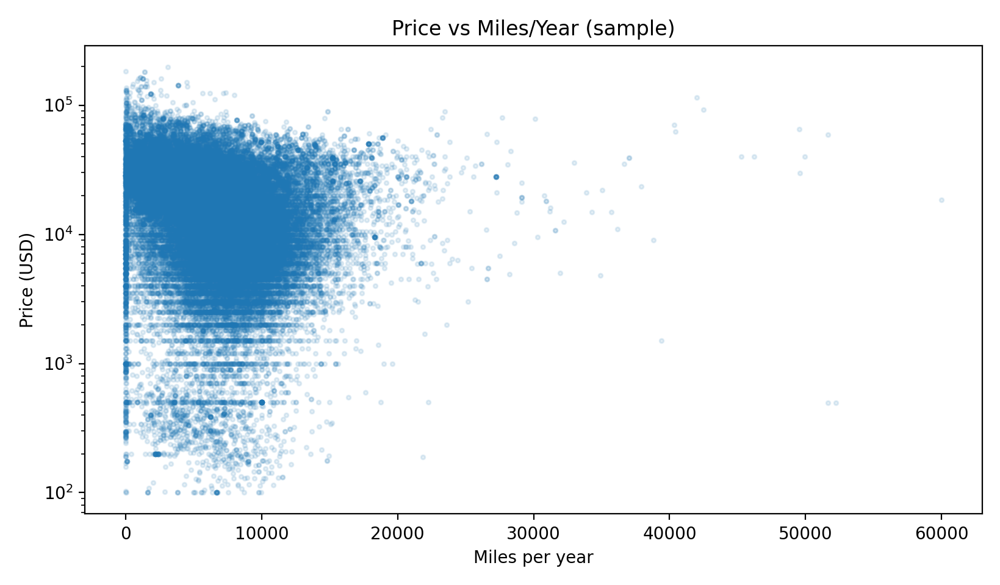

*Figure 6. Price vs miles-per-year (derived feature).*

“Miles per year” captures usage intensity by normalizing mileage by vehicle age. Two cars with 100k miles can represent very different wear levels depending on age; miles/year helps separate “high-use” from “normal-use” vehicles. The plot remains noisy, but it shows meaningful structure and supports the inclusion of derived features that represent domain concepts more directly than raw columns.

### 2.6 Missingness (practical preprocessing constraint)

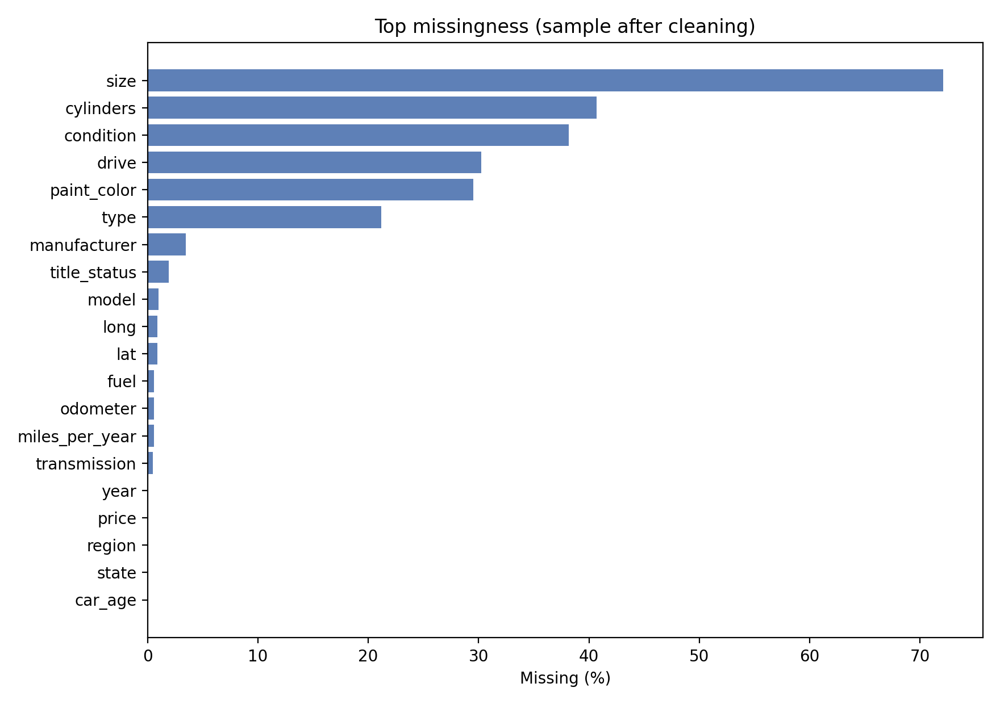

*Figure 7. Missingness rate for the most-missing columns.*

Many columns have high missingness (e.g., some categorical attributes such as size/condition/cylinders). This directly influences modeling choices: preprocessing must impute missing values robustly, and one-hot encoding must handle unseen or infrequent categories. It also affects interpretability: a coefficient or importance score for a feature with heavy missingness should be read as “the effect when present,” not as a complete explanation of price.

### 2.7 Segment effects: condition and fuel

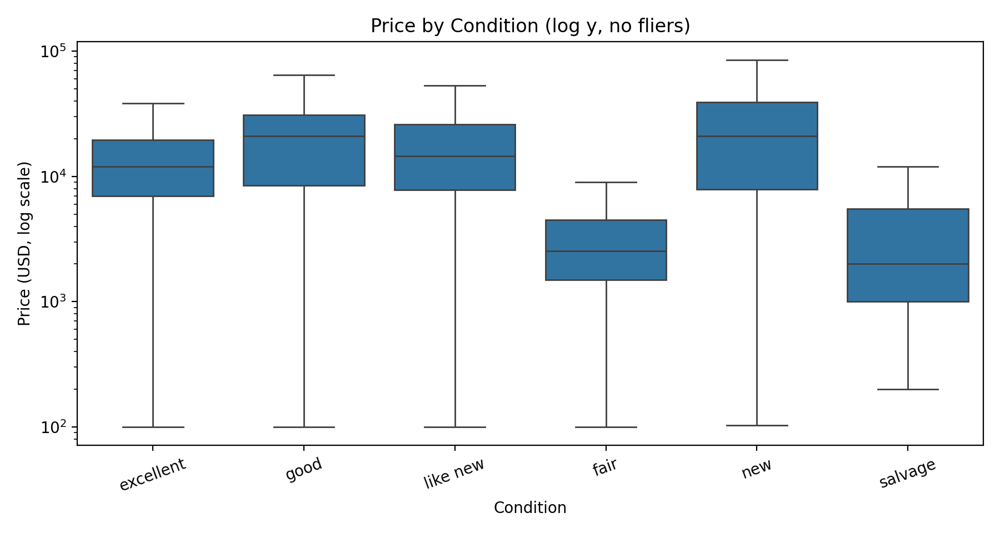

*Figure 8. Price by condition (box plot).*

Condition categories (when provided) show clear separation: better condition tends to associate with higher prices, but the spread is large and overlaps across categories. This suggests condition is informative but not sufficient on its own; it also implies potential interaction effects (e.g., “excellent” condition may matter more for some manufacturers/types). Because condition is often missing, the model must learn to handle “unknown condition” cases via imputation rather than dropping those rows.

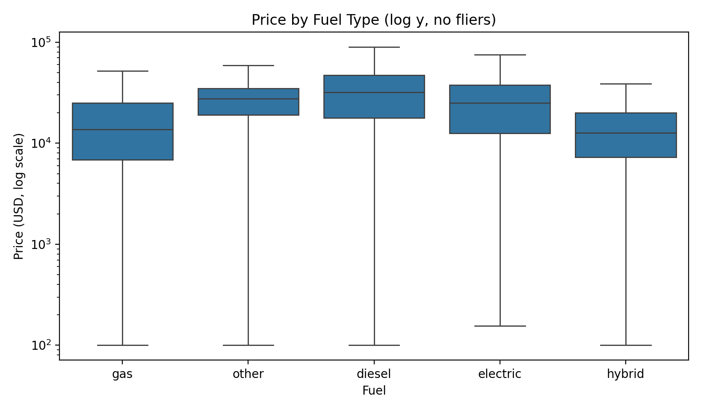

*Figure 9. Price by fuel type (box plot).*

Fuel type also changes price distributions, reflecting different segments (e.g., diesel trucks vs gasoline economy cars). The overlaps are large, which means fuel type is helpful but again interacts with other variables such as type, year, and drive. This motivates using models that can capture these interactions automatically rather than assuming additive linear effects.

### 2.8 Numeric correlation (multicollinearity hint)

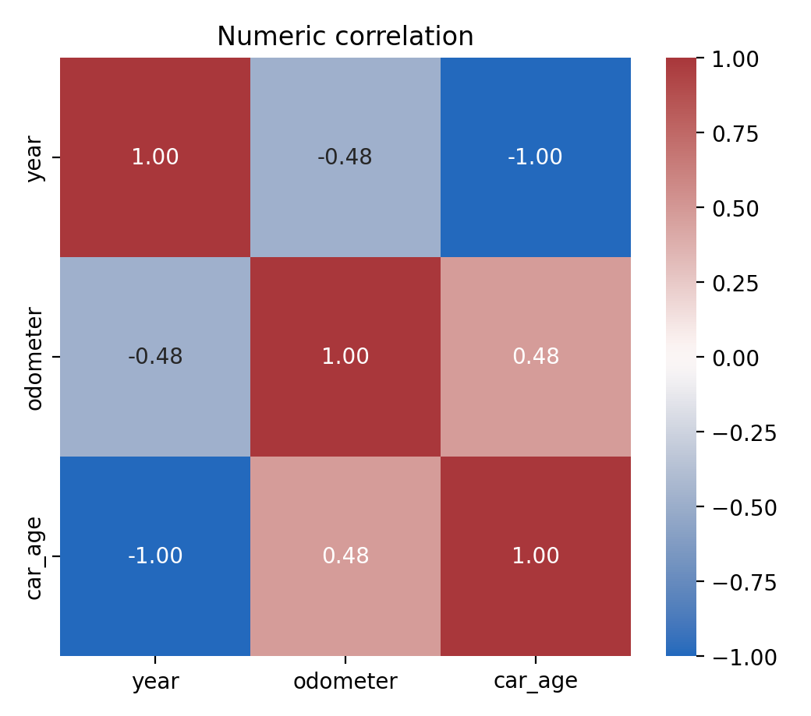

*Figure 10. Correlation heatmap for numeric features.*

Some numeric features are strongly correlated (for example, year and vehicle age are mechanically related). In linear models, multicollinearity can make coefficients unstable and inflate variance, which is why Ridge regularization is included as a baseline. In nonlinear tree models, correlation is less of an interpretability problem, but it can still affect how “importance” is distributed across correlated variables.

## 3. Data preparation and feature engineering

The cleaning pipeline applies three core ideas: (i) enforce basic numeric validity (e.g., impossible coordinates, impossible mileage ranges), (ii) filter extreme outliers to reduce the influence of clearly erroneous rows, and (iii) derive domain features that represent meaningful quantities.

Derived features used in multiple models:
- **Vehicle age**: `age = reference_year - year`
- **Miles per year**: `miles_per_year = odometer / max(age, 1)`

For missing/unknown strings in categorical columns, “empty/unknown” tokens are treated as missing values so that imputation is consistent and explicit.

## 4. Methods (models)

All approaches are implemented as supervised regression models trained on a fixed train/test split.

### 4.1 Log-target training

Because price spans orders of magnitude, many experiments train on a log-transformed target:

`y' = log(1 + y)` and invert with `y = exp(y') - 1`

This reduces the dominance of the extreme tail during optimization while still allowing evaluation in the original dollar scale after inversion.

### 4.2 Linear baselines: OLS, Ridge, Lasso

Let `X` denote the feature design matrix and `y` denote the price.

- **OLS**: `min_w ||y - Xw||²`
- **Ridge**: `min_w ||y - Xw||² + α||w||²`
- **Lasso**: `min_w ||y - Xw||² + α||w||₁`

Categorical variables are one-hot encoded for these models. Ridge is expected to handle multicollinearity better; Lasso may be too aggressive in the presence of correlated groups.

### 4.3 Ridge + TF‑IDF(description)

This model augments structured features with a sparse TF‑IDF vector derived from listing text. The hypothesis is that descriptions contain pricing cues (trim, options, condition notes) not captured by structured columns.

### 4.4 Boosted trees (HistGradientBoostingRegressor)

Boosted trees are strong models for heterogeneous tabular data because they capture nonlinear effects and interactions. This is particularly relevant here because the “same mileage” or “same year” does not imply the same price across different manufacturers and types.

## 5. Experimental protocol

- Train/test split: **80/20**, fixed seed **441** for reproducibility.
- Metrics: **R²**, **RMSE**, **MAE** on the held-out test set.
- Additional practical error summaries: median absolute error, high-percentile absolute error, and percent-within thresholds.

## 6. Results (comparison and interpretation)

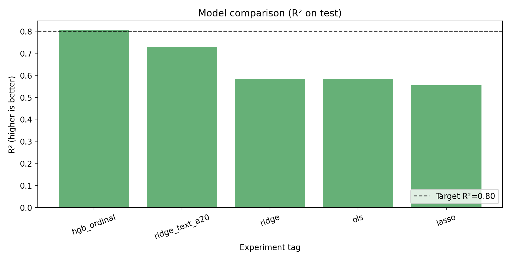

*Figure 11. Test R² across experiments.*

R² compares how well each model explains variance in price. Linear baselines plateau around ~0.55–0.58, which is consistent with underfitting nonlinear market structure. Adding text features produces a large jump (to ~0.73), indicating that unstructured descriptions carry real signal. Boosted trees achieve the best broad-domain fit (R² > 0.80), supporting the hypothesis that interactions and nonlinearities dominate performance.

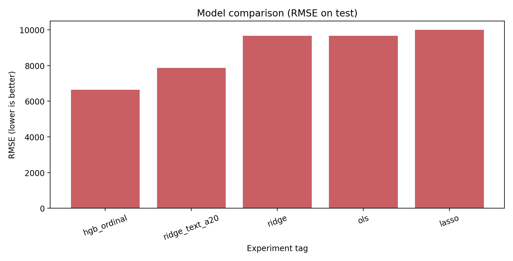

*Figure 12. Test RMSE across experiments.*

RMSE emphasizes large errors and therefore responds strongly to the heavy tail of price. The boosted tree reduces RMSE substantially compared to linear models, but the absolute RMSE remains relatively large on the broad domain due to expensive listings. Filtering to mid‑market ranges reduces RMSE further, illustrating that “RMSE in dollars” is inseparable from the price range on which it is evaluated.

### 6.1 Summary table

| Tag | Model | Domain | Test R² | Test RMSE | Test MAE |
|---|---|---|---:|---:|---:|
| `hgb_ordinal` | Boosted trees | broad | **0.8061** | 6649.38 | 3383.88 |
| `ridge_text_a20` | Ridge + TF‑IDF | broad | 0.7275 | 7865.90 | 4416.09 |
| `ridge` | Ridge | broad | 0.5835 | 9665.96 | 5684.14 |
| `ols` | OLS | broad | 0.5834 | 9667.80 | 5689.79 |
| `lasso` | Lasso | broad | 0.5540 | 10002.64 | 5973.56 |
| `hgb_midmarket_60k` | Boosted trees | max_price=60k | 0.8525 | 4981.00 | 3014.91 |
| `hgb_midmarket_30k` | Boosted trees | max_price=30k | 0.8019 | 3654.52 | 2360.37 |
| `hgb_midmarket_20k` | Boosted trees | max_price=20k | 0.7024 | **2935.79** | 1972.39 |

Interpretation of the mid‑market rows: as the maximum price decreases, RMSE decreases (because the scale shrinks and extreme outliers are removed), but R² can also decrease because the remaining variance is smaller and the task becomes “harder” in relative terms. This trade-off is expected and is the reason to report both broad-domain and domain-specific results depending on the intended usage.

## 7. Diagnostics and error analysis

### 7.1 Broad-domain best model (boosted trees)

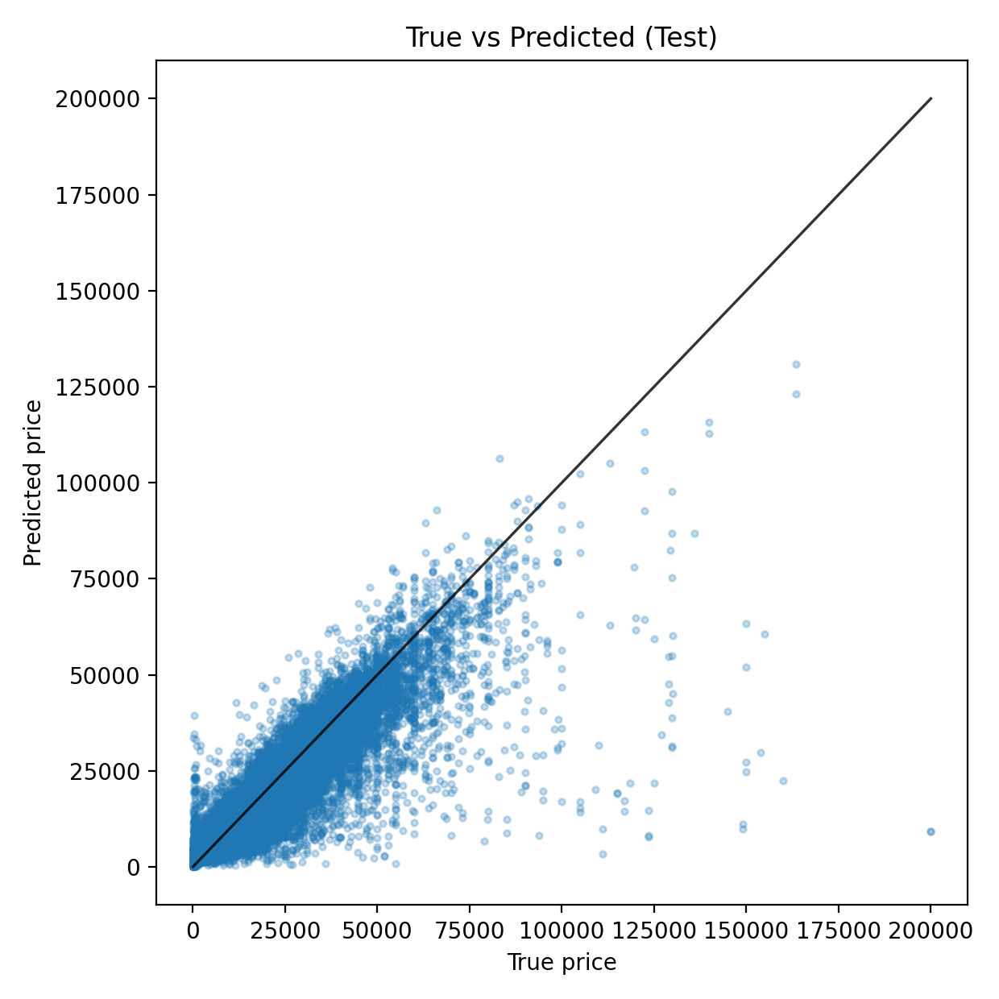

*Figure 13. True vs predicted price (test set).*

The true-vs-predicted plot shows strong alignment along the diagonal but with increasing spread at higher prices. This pattern indicates heteroskedasticity: the model’s absolute dollar errors grow as the true price increases. The plot also suggests the model is not systematically biased low or high across the entire range; rather, it has difficulty matching the variance of the tail.

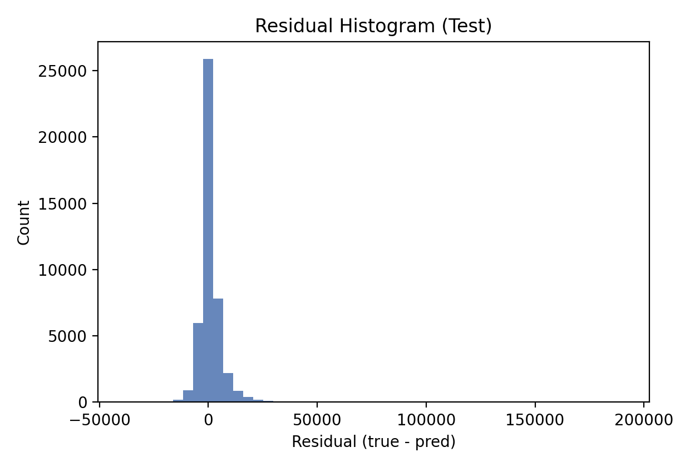

*Figure 14. Residual histogram (test set).*

The residual histogram is roughly centered near zero but has heavy tails, reflecting occasional large errors. Heavy-tailed residuals are consistent with heavy-tailed targets and heterogeneous segments. This supports reporting percentile-based error summaries (90th/95th percentile absolute error) because the mean-squared error alone can be disproportionately driven by rare large residuals.

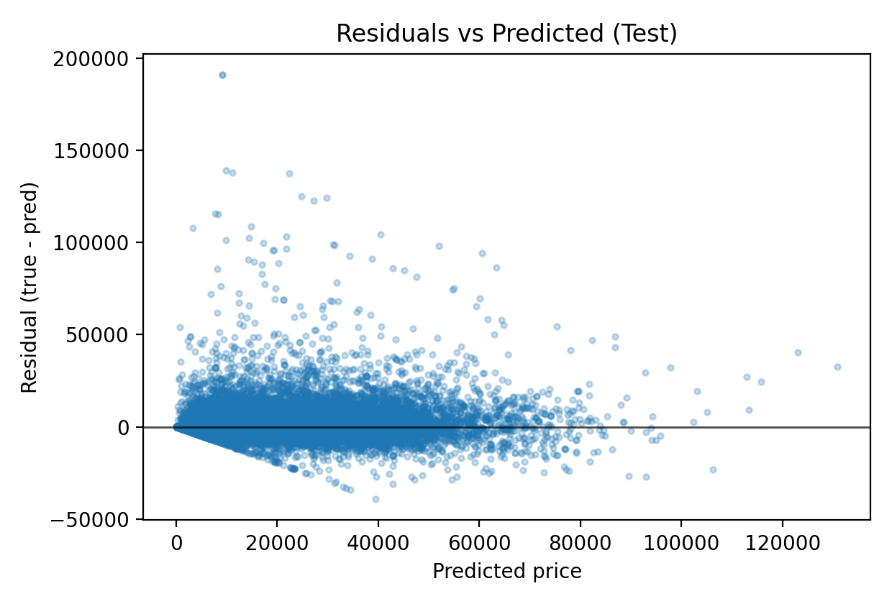

*Figure 15. Residuals vs predicted price (test set).*

Residual variance increases with predicted price, confirming heteroskedasticity. This implies that a constant-variance noise assumption (common in basic linear regression diagnostics) is violated. Practically, this means the model will often have larger dollar uncertainty for expensive vehicles, and evaluation should include relative-error views (percentage error) in addition to dollar-error views.

### 7.2 Error distribution (absolute and percentage)

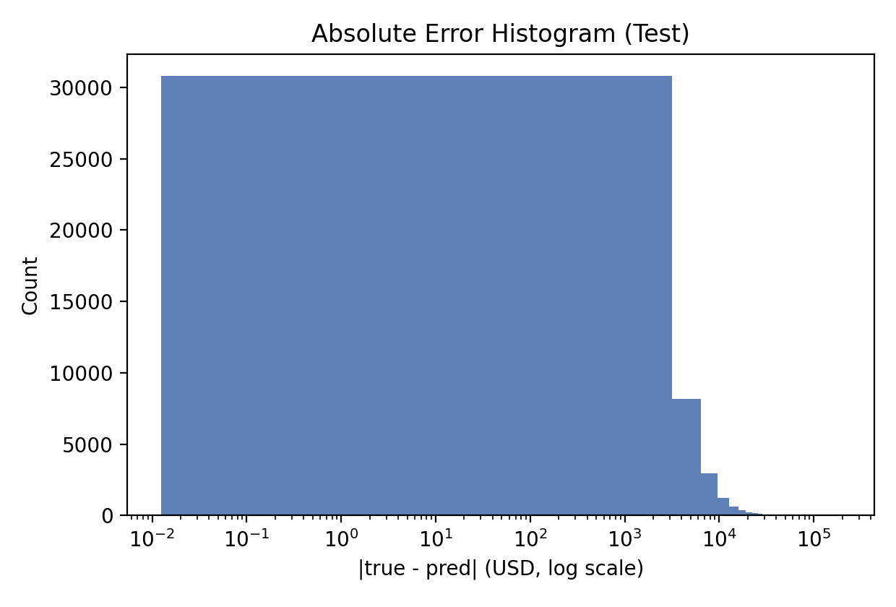

*Figure 16. Absolute error histogram (log-scaled x-axis).*

Most test predictions fall within a few thousand dollars, but there is a long tail of larger absolute errors. The long tail matters because it can dominate RMSE; however, the median error provides a more “typical case” view. In this run, the median absolute error is about **$1.8k**, which is much smaller than the RMSE, emphasizing the skewness of the error distribution.

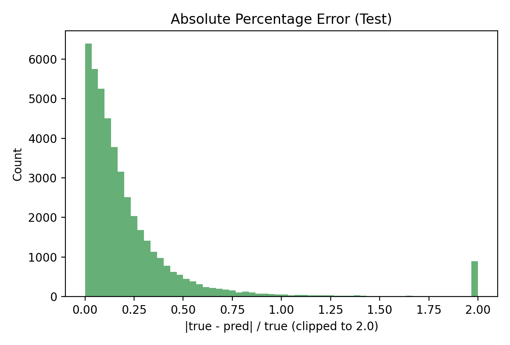

*Figure 17. Percentage error histogram (clipped for readability).*

Percentage error helps normalize for the fact that a $3,000 error is large for a $6,000 vehicle but small for a $60,000 vehicle. The distribution shows a substantial mass below 20% relative error, supporting the claim that the model is often practically useful even when RMSE appears large. This plot is essential for interpreting performance on heterogeneous price ranges.

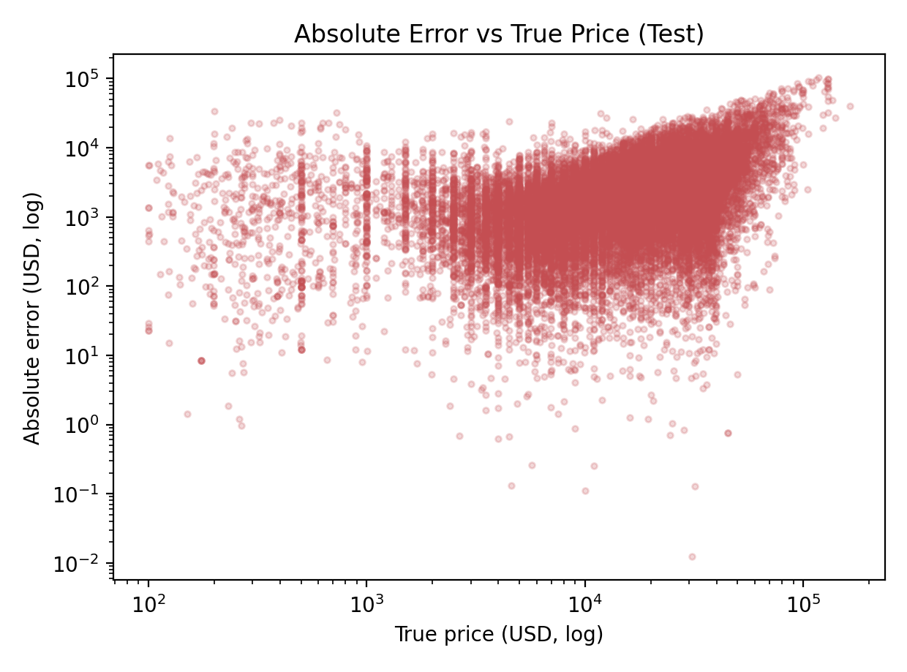

*Figure 18. Absolute error vs true price (log-log).*

Absolute error rises with true price: expensive vehicles tend to have larger dollar errors. This is the defining heteroskedastic pattern in this dataset and is a central explanation for why global RMSE targets are hard to satisfy without domain restriction. The correct interpretation is not “the model fails,” but “the error scale is larger where the target scale is larger.”

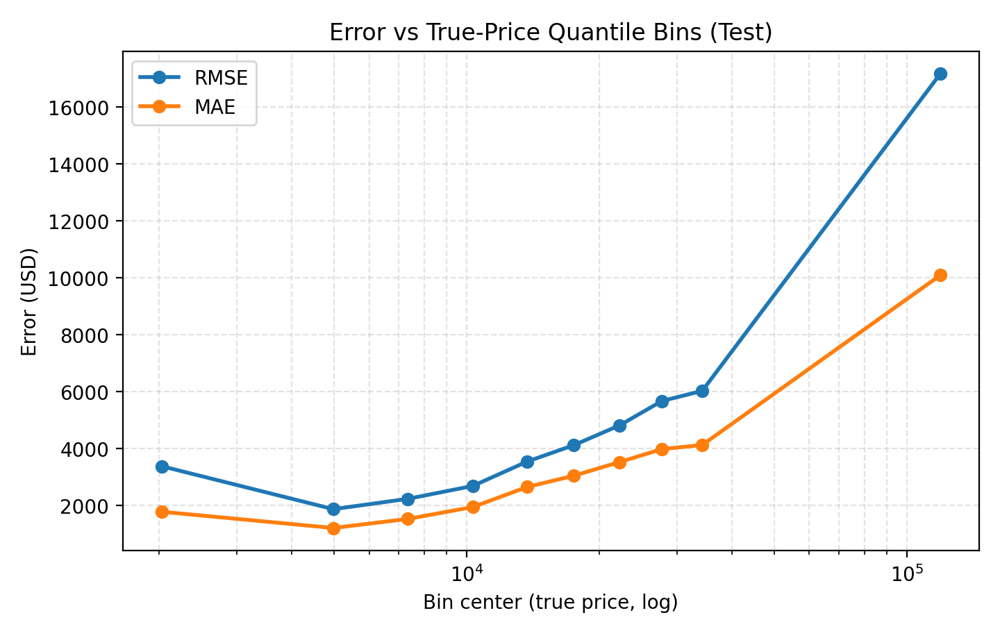

*Figure 19. RMSE/MAE by true-price quantile bins.*

Binning by true price makes the heteroskedastic pattern easier to quantify: both RMSE and MAE increase as we move to higher price bins. This plot provides a clear actionable conclusion: if the application targets a particular price range (e.g., mid‑market cars), performance should be evaluated and potentially optimized within that domain rather than across the full tail.

## 8. Feature importance and interpretation

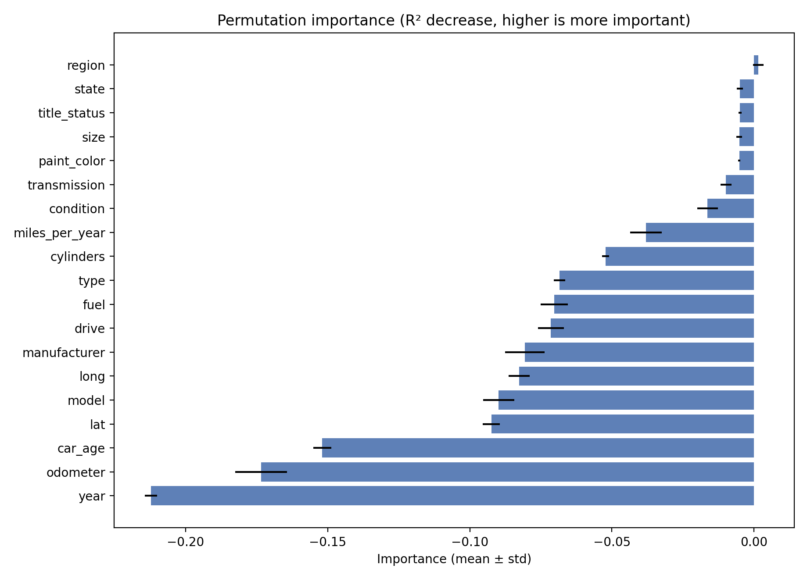

*Figure 20. Permutation importance for the broad-domain boosted-tree model.*

Permutation importance measures the decrease in performance when a feature is randomly permuted. The highest-importance features are consistent with domain intuition: age/year and mileage-related variables dominate, followed by key categoricals that define vehicle segment. The conclusion is that the model uses multiple complementary signals (age + mileage + segment) rather than relying on an implausible shortcut.

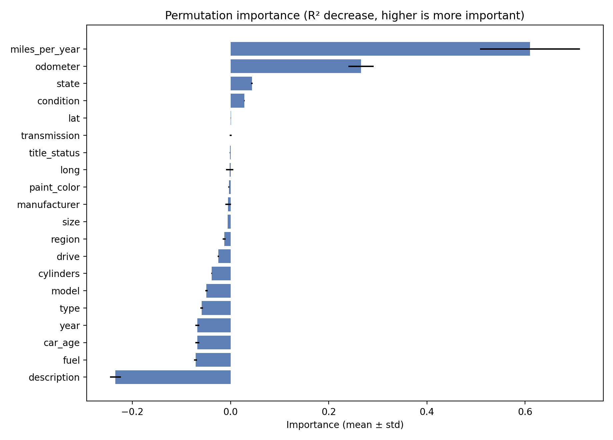

*Figure 21. Permutation importance for the text-augmented Ridge model.*

The text model shows that the `description` feature provides measurable value beyond structured attributes. This supports the hypothesis that free-text contains pricing cues such as trim/options and condition notes. The broader conclusion is that “structured-only” models leave predictive signal on the table, especially when categorical fields are missing or coarse.

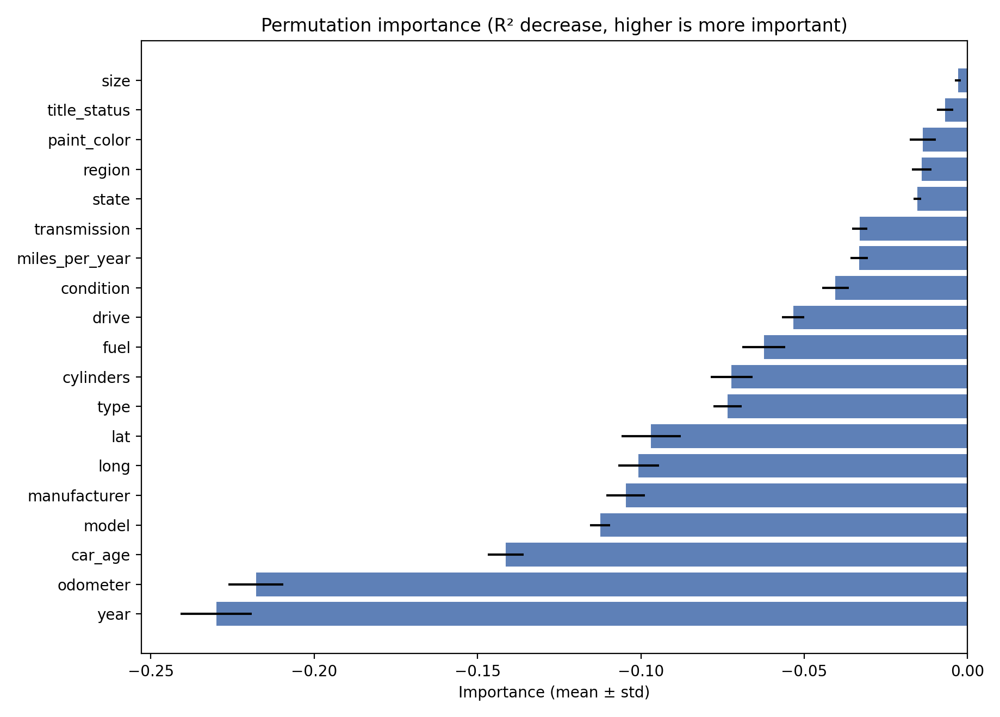

*Figure 22. Permutation importance in a mid‑market filtered domain (max price 60k).*

In the mid‑market range, the top signals remain similar: age/mileage plus a small number of strong segment categoricals. This stability suggests the model’s reasoning is not entirely different between broad and mid‑market domains; rather, the key change is that the scale of the target (and therefore the scale of absolute error) is smaller.

## 9. Demo app (Streamlit)

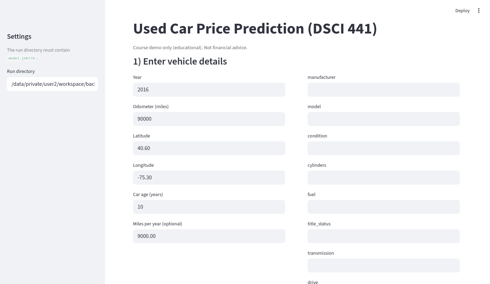

*Figure 23. Streamlit demo screenshot.*

The demo app turns the project into an interactive system: a user can input vehicle attributes and obtain an immediate price estimate. This matters for course deliverables because it demonstrates the model can be deployed as a simple product, not just evaluated offline. The demo also functions as a sanity check: it forces the inference path (preprocessing + model) to work end-to-end on a single-row input.

## 10. Reproducibility

All experiments use a fixed random seed and a consistent train/test protocol so that results can be reproduced. Models are trained and evaluated through a uniform pipeline that standardizes preprocessing across experiments, which is essential for fair comparisons. The project includes automation to rerun experiments and regenerate figures, ensuring that the report is backed by repeatable computation rather than manual one-off runs.

## 11. Limitations and future work

Limitations:
- Listing prices are noisy and may not reflect final sale prices; scraped data can contain errors and duplicates.
- Important real-world variables are missing (accident history, maintenance records, detailed trim/options, negotiation).
- Heavy-tailed targets and heteroskedasticity make “single-number” error metrics (especially RMSE) sensitive to the evaluation domain.

Future work:
- Segment-aware training/evaluation (separate models per vehicle type/price band).
- Robust losses (Huber) or quantile regression to better model asymmetric or tail risk.
- Add uncertainty estimates (prediction intervals) to communicate confidence for high-price cases.

## 12. Conclusion

This project demonstrates a full regression workflow for used-car price prediction, from exploratory analysis through modeling, diagnostics, and an interactive demo. Linear baselines underfit; incorporating text improves performance; and boosted trees achieve the strongest broad-domain fit (R² > 0.80). Error analysis shows clear heteroskedasticity and emphasizes that absolute-dollar error targets must be interpreted relative to the price domain.

## 13. Reference

Kaggle dataset: “Craigslist Cars & Trucks Data” (Austin Reese).

